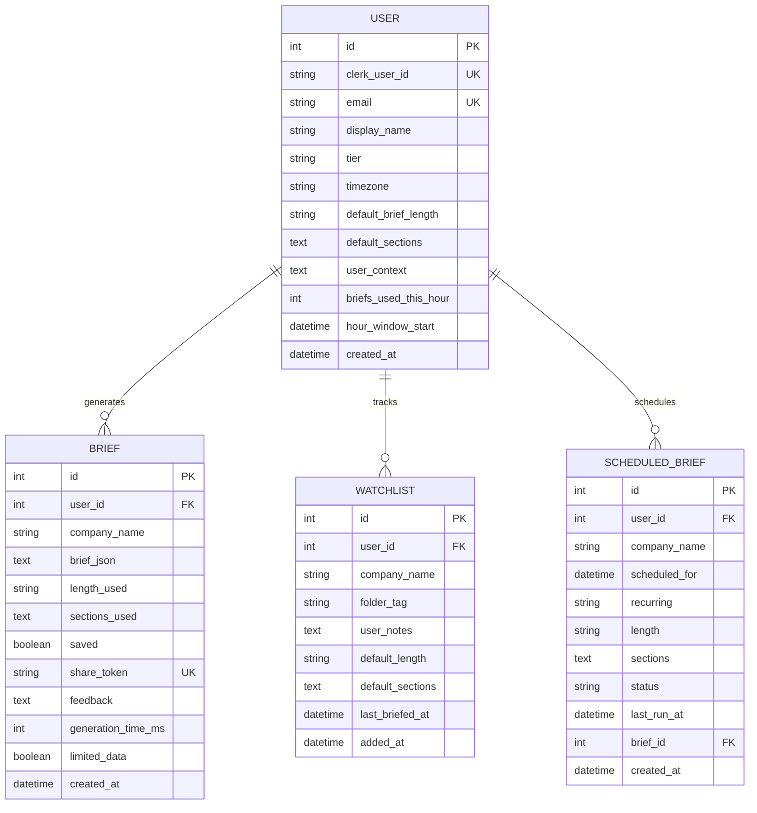
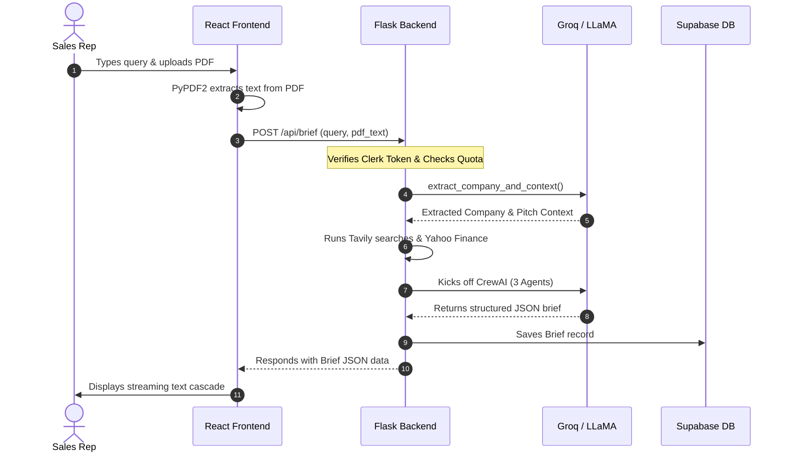

# PitchPulse AI — Full Codebase & Architecture Summary

PitchPulse is an AI-powered B2B pre-meeting sales intelligence tool. It enables sales professionals to type a single unified search query (e.g. *“Research Nvidia — pitching AI defect detection for GPU wafer fabs”*), optional PDF product context, and receive a comprehensive, structured pre-meeting brief in ~60 seconds containing live news, financial signals, competitor updates, and highly tailored talking points (HOOK, BRIDGE, and OPENER format).

This document serves as an exhaustive reference for the system’s architecture, backend capabilities, frontend components, database schemas, and implementation details.

---

## ── Tech Stack & Dependencies ──

### 1. Backend Layer (Python / Flask)
* **Framework**: Flask with CORS enabled (`flask-cors`).
* **Database & ORM**: SQLAlchemy (`flask-sqlalchemy`) with **Supabase PostgreSQL** in production (and SQLite fallback in local environment with enforced foreign key cascades).
* **AI & Agentic Framework**: CrewAI with LiteLLM for multi-agent orchestration.
* **Authentication**: Clerk JWT token signature verification (using cached JWKS public keys, strictly requiring signature validation in production mode).
* **External Integrations**:
  * **Tavily API** (`tavily-python`) for targeted web searches.
  * **Yahoo Finance API** (`yfinance` + raw HTTP fallbacks) for live market pricing, historical chart points (30 days), and financials.
  * **Resend API** (`resend`) for transactional emails (welcomes, scheduled briefs rendering all 9 brief sections).
  * **PyPDF2** for client-side PDF product documentation parsing.
* **Rate Limiting**: Sliding hour window per user enforcing a limit of 3 briefs/hour for the free tier.

### 2. Frontend Layer (React / Vite)
* **State Management**: Zustand stores (`authStore`, `prefsStore`).
* **Styling**: Tailwind CSS, Vanilla CSS (`index.css`), custom Google Fonts (Inter + Space Grotesk).
* **Animations**: Framer Motion for smooth micro-interactions, word reveals, layout transitions, and page load cascades.
* **Interactive Charts**: Custom SVG/Framer-based lightweight financial charts.
* **Auth**: Clerk React SDK (`@clerk/clerk-react`) for secure authentication flows.
* **Routing**: React Router DOM (`react-router-dom`) with client-side route protection.
* **Error Resilience**: A dedicated `ErrorScreen` system panel to catch API failures on key views (Dashboard, Brief Display, History, and Share Link Page) with Retry/Return actions.

---

## ── Directory Structure & File Map ──

```
PitchPulse/
├── backend/
│   ├── app.py                # Main Flask app, API routes, Clerk auth, and rate-limiting
│   ├── agents.py             # CrewAI multi-agent crew, LLM key rotators, prompt templates
│   ├── tools.py              # Custom Tavily Web Search and yfinance lookup tools
│   ├── scheduler.py          # Due brief queue processor called via cron endpoint (resilient recurrence)
│   ├── email_service.py      # Resend client setups and HTML newsletter-style email templates (renders all sections)
│   ├── database.py           # SQLAlchemy database initialization utility (SQLite FK listener)
│   ├── models.py             # User, Brief, Watchlist, ScheduledBrief db entities (cascade delete relations)
│   ├── config.py             # Environment configurations and validation logic
│   ├── utils/
│   │   ├── sanitize.py       # Company name sanitization helpers
│   │   └── ticker.py         # Ticker symbol resolution / private-company detection
│   └── requirements.txt      # Python package list
│
├── frontend/
│   ├── public/
│   │   └── auth-7.avif       # Localized authentication background asset
│   ├── src/
│   │   ├── App.jsx           # Routing configuration & global React setup
│   │   ├── main.jsx          # React DOM mounting and Clerk context provider wrapper
│   │   ├── index.css         # Typography, global scrollbars, theme styles, Apple squircles
│   │   ├── pages/            # View components corresponding to app routes
│   │   ├── components/       # Reusable UI widgets (ErrorScreen, MobileBottomNav, etc.)
│   │   ├── store/            # Zustand store definitions for auth and prefs
│   │   ├── hooks/            # Custom hooks (e.g. useTheme for system/light/dark state)
│   │   ├── lib/              # Client setups (axios interceptors, API defaults)
│   │   └── utils/            # Helper utils
│   ├── package.json          # Node dependencies
│   ├── tailwind.config.js    # Tailwind theme customization
│   └── vite.config.js        # Vite PWA configurations with Workbox api cache-rules
│
├── .gitignore                # Root gitignore excluding md temp files and env configurations
├── context.md                # System metadata
└── README.md                 # System overview (this document)
```

---

## ── Database Schema (`backend/models.py`) ──

PitchPulse utilizes four primary database tables. Foreign keys map back to the `User` model, with cascading deletions enabled.



---

## ── Backend Implementation Details ──

### 1. Unified Authentication & Clerk Validation (`backend/app.py`)
Clerk handles identity provider processes. The backend validates Clerk tokens locally:
* Retrieves the Clerk JWKS key list from `CLERK_JWKS_URL` and caches it using `@lru_cache`.
* On encountering unknown kids (key IDs), it clears the cache and refetches keys once to support key rotations.
* Translates the signature verification claims to verify issuer correctness and expiration (`verify_exp: True`).
* Strict verification checks block signature bypass fallbacks in production.

### 2. Multi-Agent Synthesis Crew (`backend/agents.py`)
Brief generation is driven by **CrewAI**.
* **Key Rotator**: Implements a thread-safe random load rotation between `GROQ_API_KEY` and `GROQ_API_KEY_2` to spread rate-limit quotas under load.
* **LLM Config**:
  * **Free models**: `meta-llama/llama-4-scout-17b-16e-instruct` (30K TPM, default) and `groq/compound-mini` (70K TPM).
  * **Pro models**: `llama-3.3-70b-versatile` (12K TPM), `openai/gpt-oss-120b` (8K TPM), and `groq/compound` (70K TPM).
* **Agents**:
  1. **Senior Company Intelligence Researcher**: Reads compiled search results and Yahoo Finance output, extracting strategic company developments, hiring cues, and news. Cites sources.
  2. **Strategic Sales Intelligence Analyst**: Contextualizes findings according to the sales rep's pitch. Formulates **Talking Points** consisting of:
     * **HOOK**: A verifiable fact, date, or number from the research data.
     * **BRIDGE**: How the rep's solution maps to that fact.
     * **OPENER**: The specific conversation opener text.
  3. **Pre-Meeting Brief Specialist**: Formats the synthesized outputs into a rigid, non-markdown-fenced JSON structure.
* **JSON Repair Engine**: Includes a stack-based bracket/brace parser (`_repair_truncated_json`, `_extract_json`) that dynamically appends missing nested closures if an LLM is cut off mid-response.

### 3. Integrated Research Tools (`backend/tools.py`)
* **`company_web_search`**: Utilizes Tavily Advanced search to perform targeted crawls. Combines counts to monitor results.
* **`company_financial_data`**: Resolves the company name to a stock ticker using Yahoo Finance Search. On discovery, fetches TTM revenues, revenue growth YoY, market cap, full-time employees, margins, sector description, and business summaries.

### 4. Cron Scheduler (`backend/scheduler.py`)
* A POST endpoint (`/api/cron/process-scheduled`) is triggered periodically by an external cron worker. It checks the authorization header using `CRON_SECRET`.
* Selects all pending scheduled briefings whose `scheduled_for` timestamp is in the past.
* Evaluates the hourly rate limits of the owner user. If a free user has exceeded their quota, the job is rescheduled for the start of their next hour window instead of failing.
* Executes `run_brief` in the background, generates a database record, emails the HTML copy containing all active sections to the user via Resend, and queues the next recurrence even on failures.

---

## ── Frontend Pages & Features ──

### 1. Landing Page (`frontend/src/pages/LandingPage.jsx`)
* Combines visual showcases, scroll-driven stats grids, feature check comparisons, and the interactive `SideScrollFeatures` component.
* Uses `overflow-x: clip` rather than `overflow-x: hidden` to prevent breaking CSS `position: sticky` on nested sidebar child containers.

### 2. Dashboard (`frontend/src/pages/DashboardPage.jsx`)
* Shows the user's recent briefs with pagination and text-search filtering.
* Houses a folder-organized **Watchlist** sidebar widget, showcasing tracked companies, user notes, and a direct "Generate Brief" trigger.
* Features touch-friendly action controls and fallback error retry panels.

### 3. Brief Generator (`frontend/src/pages/BriefGeneratorPage.jsx`)
* Provides a unified natural language chat bar for inputs.
* Supports **PDF context uploads** (up to 2MB) using PyPDF2 to extract details, passing it to the backend to constrain talking points.
* Includes configurable length controls (Short, Medium, Long) and a selection model picker.

### 4. Brief Viewer (`frontend/src/pages/BriefDisplayPage.jsx`)
* Features a modular panel displaying the generated company intelligence, news cards, financial metrics, and executive summaries.
* **Interactive Stock Chart**: Generates dynamic line charts from historical stock values, showing ticker names and market movements.
* **Talking Points**: Displays the HOOK, BRIDGE, and OPENER elements in interactive cards with feedback thumbs.
* **Sharing**: Generates unique public share links (`/brief/share/:token`) that bypass auth.

---

## ── Core Workflows ──



---

## ── Environment Variable Configs ──

### Backend `.env` (Ignored from version control)
```ini
GROQ_API_KEY=gsk_...           # Primary Groq API key
GROQ_API_KEY_2=gsk_...         # Secondary key for load rotation (optional)
TAVILY_API_KEY=tvly-...        # Tavily search credential
RESEND_API_KEY=re_...          # Resend email API key
CLERK_SECRET_KEY=sk_test_...   # Clerk secret
CLERK_PUBLISHABLE_KEY=pk_...   # Clerk public publishable key
CLERK_JWKS_URL=https://...     # Clerk JWKS endpoint (required in production — enforces JWT signature checks)
CRON_SECRET=super_secret_...   # Cron endpoint security key
SECRET_KEY=app_signing_...     # Flask session key
FRONTEND_URL=http://localhost:5173
DATABASE_URL=postgresql://...  # Supabase PostgreSQL URL
FROM_EMAIL=onboarding@resend.dev
```

### Frontend `.env` (Ignored from version control)
```ini
VITE_CLERK_PUBLISHABLE_KEY=pk_test_... # Clerk publishable key
VITE_API_URL=http://localhost:5001     # Flask backend endpoint (Render)
```

